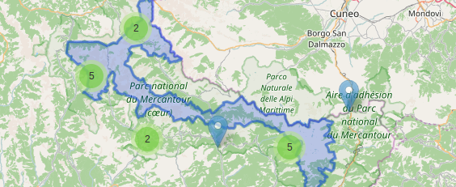

# Fonctionnement du clustering



Le clustring permet de regrouper des marqueurs entre eux s'il sont suffisament proche à un niveau de zoom définit
C'est notamment utile pour éviter des superositions aux faibles niveaux de zoom.

## Activer le clustering sur un layer

Pour activer le clustering sur un layer, il suffit de lui mettre la propriété `cluster` à `true`.

Exemple :
``` json
{
	"id":"must-see",
	"name": "Incontournables",
	"type": "geojson",
	"active": true,
	"cluster": true,
	"champ_geom": "geom",
	"table": "tourisme.sites_incontournables",
	"fields": "id, title, descript, file, other, pic_1, titlepic_1, ownerpic_1, pic_2, titlepic_2, ownerpic_2, video",
	"group": "tourism",
	"options": {
		"onEachFeature": "function (feature, layer) {layer.bindTooltip('<h2>' + feature.properties.title + '</h2>');}"
	}
}
```
