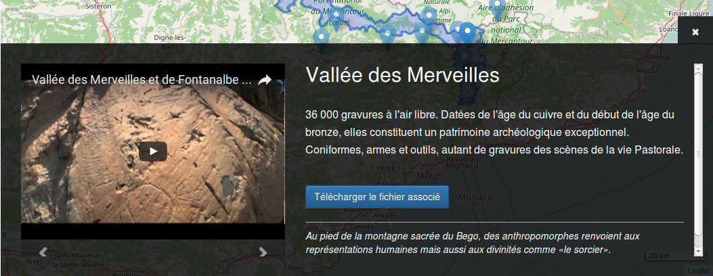

# Fonctionnement du bandeau d'information de bas de carte



## Activer le bandeau

Le bandeau est présent dans la page mais ne s'affiche au click sur un élément d'overlay, que si ce dernier à la valeur `infoBand` à `true`

Exemple :
``` json
{
	"id":"must-see",
	"name": "Incontournables",
	"type": "geojson",
	"active": true,
	"infoBand": true,
	"champ_geom": "geom",
	"table": "tourisme.sites_incontournables",
	"fields": "id, title, descript, file, other, pic_1, titlepic_1, ownerpic_1, pic_2, titlepic_2, ownerpic_2, video",
	"group": "tourism",
	"options": {
		"onEachFeature": "function (feature, layer) {layer.bindTooltip('<h2>' + feature.properties.title + '</h2>');}"
	}
}
```

## Utilisation des propriétés

Les propriétés utilisées par le bandeau sont limitées à la liste suivante :

* **title** : Le titre affiché en haut du bandeau
* **descript**: La description principale affichée en dessous du titre
* **file**: Un fichier téléchargeable lié à l'élément. Il se situe sous la description
* **other**: Informations supplémentaires affichée en italique après le fichier de téléchargement. Ce bloc est précédé d'un filet blanc
* le carousel via les propriétés :
	* **pic_1** et **pic_2** : représentent les 2 photos présentes dans le carousel.
	* **titlepic_1** et **titlepic_2** : représentent les légendes respectives des photos. Elles sont affichées sur le bas de la photo
	* **ownerpic_1** et **ownerpic_2** : représentent les auteurs respectifs des photos. Ils sont situés en dessous de la légende
	* **video** : si déclaré, ajoute une vidéo en premier élément du carousel

*Toutes les propriétés sont optionelles*