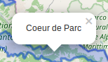

# Ajouter une popup à un layer dans le fichier de config

## Créer une popup Leaflet

Afin d'ajouter une popup à un *overlay*, il suffit dans ses options de rajouter la propriété `onEachFeature` avec l'instruction suivante :

``` javascript
onEachFeature: function (feature, layer) {
	layer.bindPopup('Coeur de Parc');
}
```

Attention c'est bien sur **layer** qu'il faut appeler bindPopup et non pas sur feature.

La fonction `bindPopup` prend en paramètre le contenu de la popup. Il peut s'agir aussi bien de **texte** que de **HTML**.

Ainsi, on peut simplement écrire un court texte qui sera rendu tel que :



Ou un version plus travaillée :

``` javascript
onEachFeature: function (feature, layer) {
	layer.bindPopup('<h2>Coeur de Parc</h2><p>Ceci est un paragraphe expliquant ce qu\'est le coeur de parc !</p>');
}
```

qui sera rendue ainsi :


## Intégration dans la plateforme

Actuellement la plateforme accepte les options d'un overlay sous forme d'une *string* contenant l'objet option sérializé.

Cela implique plusieurs choses pour le code de la popup :
* Tout le code doit être mis sur une ligne
* Les charactères à échaper dans le paramètre de `bindPopup` doivent être doublement échapés

Ainsi les exmeples précédens seront écris ainsi :

**Texte simple**
```
onEachFeature: function (feature, layer) {layer.bindPopup('Coeur de Parc');}
```

**HTML**
```
onEachFeature: function (feature, layer) {layer.bindPopup('<h2>Coeur de Parc</h2><p>Ceci est un paragraphe expliquant ce qu\\'est le coeur de parc !</p>')}
```

Ce qui, une fois sérializé avec les autres propriétés des options donne :

``` json
options: "{styles: function () {...}, onEachFeature: function (feature, layer) {layer.bindPopup('Coeur de Parc');}}"
```